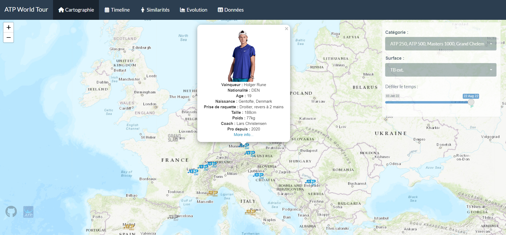
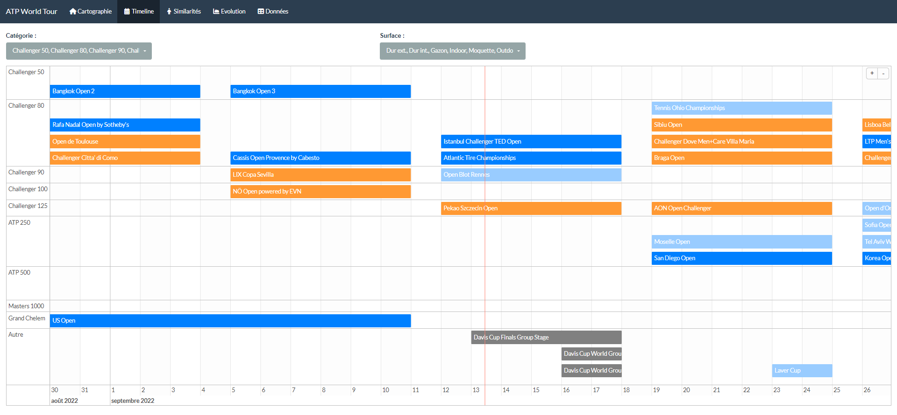
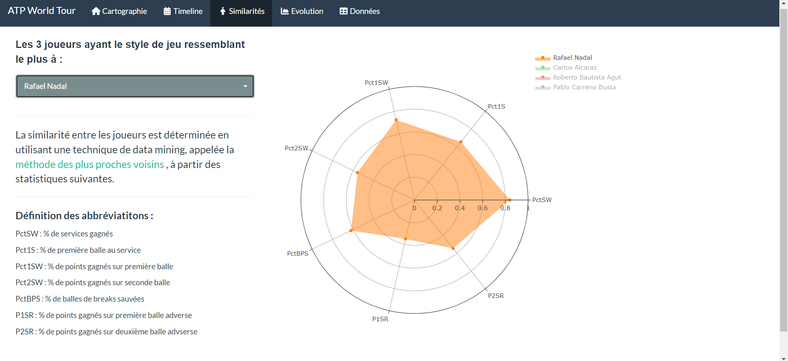
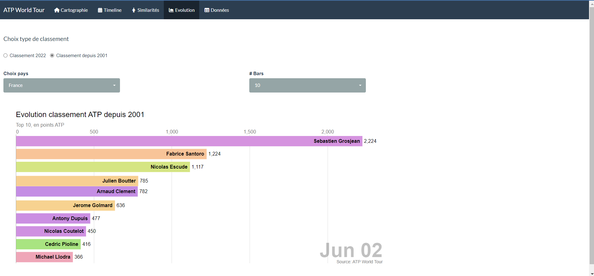
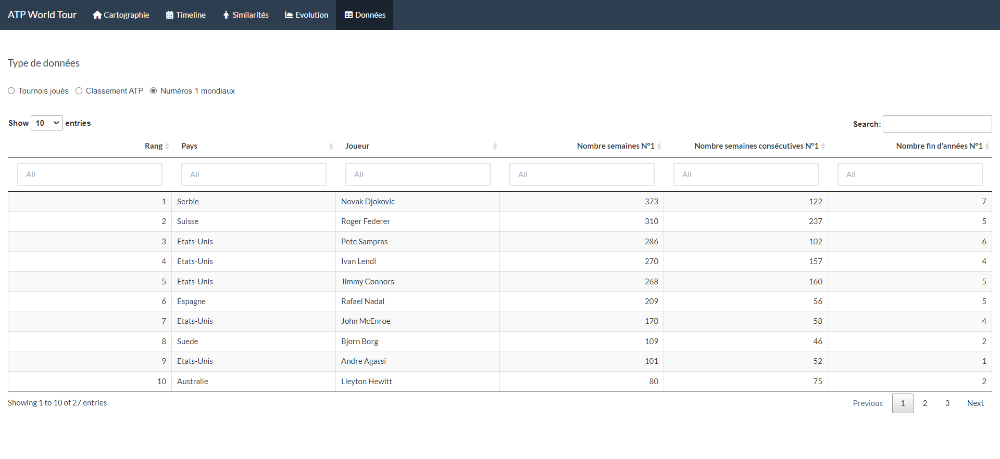

# Projet ATP

## A propos de l’application

En recherche d’un nouveau challenge professionnellement, j’ai décidé de
me challenger en souhaitant créer une application de visualisation de
données sur le circuit de tennis ATP, sport qui est l’une de mes grandes
passions. Pour réaliser ce projet, quoi de mieux que R-Shiny ??

Le projet a donc été réalisé avec R, un célèbre langage de programmation
gratuit/open-source, et reconnu dans l’utilisation de l’analyse de
données, et plus particulièrement dans notre cas, pour la visualisation
de données, à travers le package [shiny](https://shiny.rstudio.com/).

L’application est hébergée grauitement sur <http://www.shinyapps.io>.
Elle est malheureusement désactivée après 25h par mois d’usage. Si vous
souhaitez lancer le code depuis votre ordinateur, vous pouvez
télécharger R [ici](https://cran.r-project.org/) et l’IDE R Studio
[ici](https://www.rstudio.com/products/rstudio/download/#download).

## Liens

-   Live version: [Projet ATP - Live
    app](https://antoinesetif.shinyapps.io/projet_tennis/).
-   GitHub: [Projet ATP - Github](https://github.com/Twan76/Projet_ATP)

## Source de données

Toute les données ont été scrappées depuis le site officiel de
l’[ATP](atptour.com). Elles contiennent les données des tournois du
circuit principal (ATP), mais aussi secondaire (Challengers), mais aussi
les données/caractéristiques principales des joueurs. Notez que si
l’architecture de ce site est amené à évoluer, le code présent dans le
fichier “Extraction_Data.R” sera obselète.

## Usage
L'application est décomposée en 5 onglets :

- Le premier panel (Cartographie) nous montre l'évolution des vainqueurs des tournois (ATP, challengers) à travers le temps. Vous pouvez filtrer par catégorie et surface. En passant la souris sur le logo (catégorie circuit), vous obtiendez des informations sur le tournoi. Si vous cliquez sur le logo du tournoi, vous apercevrez le vainqueur, ainsi que des caractéristiques basiques du joueur.

- Le second (Calendrier), nous montre sous forme de timeline, le calendrier du circuit ATP et challenger. La couleur du bloc désigne une surface.

- Vient ensuite l'onglet (Similarités) qui cherche à trouver les 3 joueurs présentant les caractéristiques statistiques (service/retour) les plus proches par rapport à un joueur donné.

- L'onglet suivant (Evolutions) est dédié au barchart race décomposé en 2 : le premier nous montre l'évolution du classement ATP 2022 à chaque actualisation du classement (tous les lundis excepté période de grand chelem), le second nous produit l'évolution du classement ATP depuis 2001 à chaque début de mois. Pour chacun des 2 graphiques, vous pouvez décidez de garder l'ensemble des nationalités ou de n'en sélectionner qu'une seule. De cette manière, nous pouvons retrouver des anciennes gloires passées (exemple : évolution du TOP 25 francais en 2001).

- Enfin, le dernier pannel (Données) restitue les données brutes des tournois joués en 2022 sur le circuit ATP et challenger, le classement ATP 2022 à jour au complet (plus de 2000 joueurs) et un tableau historique des joueurs ayant été numéros uns mondiaux depuis la création de l'ATP (1972).

## Inspirations

L’application n’aurait pas pu voir le jour sans avoir au préalable
consulté :

- [ThinkR](https://github.com/ThinkR-open/golem), pour la
construction de l’architecture de l’application avec le package golem. 
- [AllezCannes](https://github.com/AllezCannes/WorldCupSquads) et
[eparker12](https://github.com/eparker12/nCoV_tracker), pour la
visualisation sous forme de mapping. 
- [voronoys](https://github.com/voronoys/barchartraceR2D3), créateur du
package R2D3 contenant la fonction barchartrace.
- [ThiagoValentimMarques](https://github.com/ThiagoValentimMarques/The-ten-most-similar-players-Pro-Evolution-Soccer-2019),
pour le rendu sous forme de radar.

## Contact

<asetif@gmail.com>
